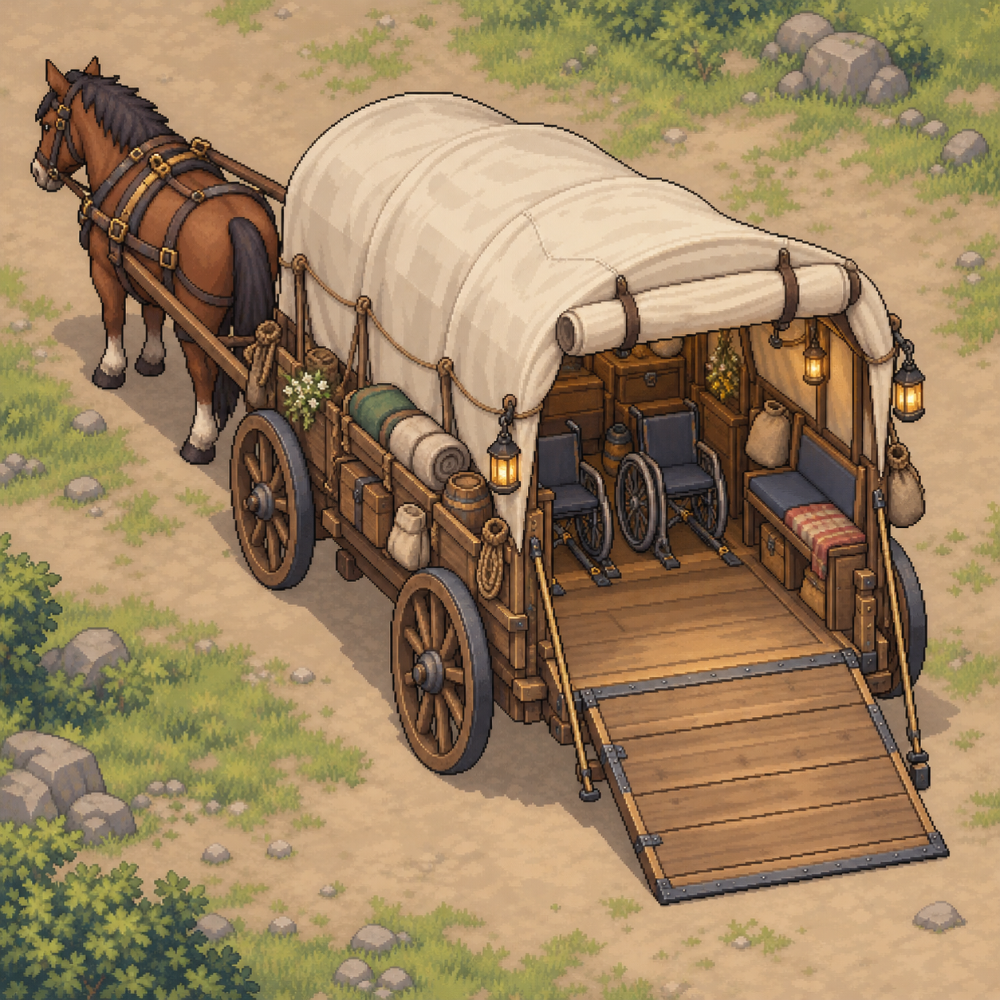
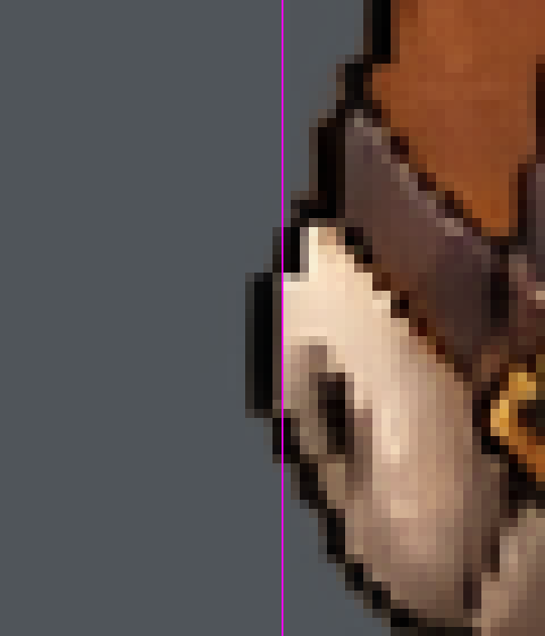

# Main21 접근 가능한 귀환 마차 v1 — 아트 검수 및 독립 등록

2026-10-10 · **PNG_STATIC_IMPORT_PASS / ANIMATION_HANDOFF_PENDING / USER_ART_REVIEW_PENDING / RETURN_EVENT_NOT_IMPLEMENTED**

## 판정과 범위

정지 상태 PNG는 기술 PASS이며 독립 등록 가능하다. 열린/닫힌 마차 Sprite2개와 미분할 참고 Texture2개를 신규 전용 경로에 등록하고 Unity6000.6.5f1의 실제 Importer/AssetDatabase를 확인했다. 이는 접근성 공간·최종 미술 승인이나 애니메이션/귀환 이벤트 구현 PASS가 아니다. 필수 접근 구조가 누락됐다고 단정할 근거는 없으며 원본 수정 요청 대신 아래 시각 검토·납품 정보 보완을 분리한다.

관련 정본: [자동 귀환 구현 준비](../03_스토리/Main21_자동귀환_마차_구현준비_20261010.md), [Main21 초안](../03_스토리/Chapter2_Main21_돌아온_온기.md). 하렌 이름 확정은 별도 commit `0ae6b3b`이며 마차 아트 등록과 구분했다.

## 원본·PNG·Manifest

- ZIP `F:/Downloads/Limitless_Main21_Accessible_Wagon_Art_v1.zip`, 8,731,762 bytes. SHA256 `70869a9d49d203da50d8d11d22ac2ffa03abcb45056f266452285503a2c38a1c`.
- ZIP CRC PASS, PNG5/5 디코딩 PASS, 모두 RGBA1254×1254. 파일·크기·역할은 Manifest.md와 일치한다. JSON Manifest는 없으나 필수 요구 형식으로 가정하지 않았다. 원본 ZIP/PNG 바이트 보존, 등록한4개 모두 원본 SHA256 일치.
- 마차2/말/부품 PNG는 alpha0~255의 투명 배경. Preview는 alpha225~250이고 완전 투명 픽셀0으로, 배경 포함 참고 이미지이며 게임 Sprite로 등록하지 않았다.
- 1/255 alpha의 극소 경계 잔여 픽셀이 존재한다. alpha>=128 본체 bbox는 열린(64,20,1221,1228), 닫힌(90,90,1200,1132)로 캔버스 안에 있으며 본체 잘림은 확인되지 않았다. bbox는 좌상단 기준 오른쪽/하단 배타 좌표다. 저알파 잔여와 최종 축소 가독성은 사용자 미술 검토 항목이다.
- Manifest에 PPU/Pivot·프레임 Rect·Anchor·레이어 Sorting/분리·재생 속도·탑승 치수가 없다. 아래 등록용 값은 런타임 최종 계약을 대신하지 않는다.

## 접근성·구조 시각 검수

| 항목 | 관찰 / 판정 |
|---|---|
| 휠체어2대 | 열린/닫힌 그림에 휠체어2대와 고정장치처럼 보이는 바닥 표현 존재. **시각적 개연성 있음 / 실제 동시 수용 USER_ART_REVIEW_PENDING** |
| 총5명·좌석 | 우측 벤치와 실내 공간 존재. 폴+지체 Player2명과 미엘·태온·세린3명의 좌석/다리/머리 여유·짐 배치가 치수 없이 증명되지 않음. 일반 Player 조건도 동일 마차 사용 |
| 램프/승강 | 열린 후방 경사판과 닫힌 후방 문 존재. 접이식 승강 방향에 부합. 출입 폭·경사·문턱·회전 동선은 치수/내부 평면 확인 대기 |
| 주행 안전 | RampClosed에서 후방 문 닫힘 표현 확인. Open/Closed의 공통 차체 콘셉트는 일관됨. 같은 캔버스라도 몸체 위치/크기 차이가 있어 단순 Sprite 교환 정렬은 미검증 |
| 바퀴/말/차체 비례 | 차체 바퀴·견인 말 표현 있음. 독립 PNG 상대 Scale과 앞 견인 지점이 미정이어서 합성 후 비례는 시각 검토 필요 |
| 기존 캐릭터 합성 | 빈 휠체어2대가 본체 PNG에 그려져 있음. 기존 폴/Player 휠체어 Sprite를 그대로 올리면 중복될 수 있음. 몸체/탑승자 가림 레이어 또는 표현 방식 계약 필요. 강제 하차·보행 전환 금지 |

탑승자/휠체어 기준 크기, 내부 상면도 또는5인 배치 도해와 램프 치수, 폴+지체 Player 동시 배치 검토를 후속 확보한다. 일반 Player일 때도 폴의 휠체어와 좌석을 보존한다. 접근성 구조를 비극·특별 이벤트로 과장하지 않는다.

## 애니메이션·레이어·Anchor

말 시트는 **3포즈 참고 이미지**이며 정식3프레임 Sprite Sheet로 확정하지 않았다. 1254px을418px씩 균등 분할하면 경계 x835/y421~445의25개 및 x836/y420~445의26개 픽셀에 alpha>=128이 존재한다. 따라서 균등 Grid 자동 Slice는 포즈 일부를 절단/다음 셀로 넘길 수 있어 실행하지 않았다. Manifest가 균등 Grid를 약속한 것은 아니므로 이를 PNG 손상으로 판정하지 않는다. 프레임별 독립 Rect·공통 Pivot/발 접지점·재생 순서/FPS·패딩 또는 개별 프레임 PNG가 필요하다.

Parts Sheet는 바퀴·램프·견인부 **참고 모음**이다. 실제 본체 바퀴 제거 레이어나 관절점이 제공됐다고 해석하지 않는다. 완성 본체에 회전 바퀴를 덧붙이면 이중 바퀴가 될 수 있다. 후속 선택은 정지 본체+배경 스크롤 우선이며, 별도 바퀴 애니메이션은 레이어 계약 후 검토한다.

필요한 Anchor: 공통 WagonRoot/접지선, BoardingEntry/RampHinge, WheelchairSlot_A/B, PassengerSeat1~3, Hitch/HorseRoot, 앞·뒤 가림 경계. **명칭은 설계 후보이며 좌표/Runtime ID는 TBD**. 레이어 후보: 배경→말/차체→탑승자→전경/문 가림→자막·Skip. 최종 Sorting 값 미정.

## 실제 Unity 등록 결과

경로는 `Assets/_Project/Art/Story/Main21Carriage/V1/`이며 새 GUID를 등록했다. 기존 공용 Sprite/Scene/Prefab 연결 없음.

| 상대 경로 | 실제 Import 상태 | GUID |
|---|---|---|
| Wagon/Accessible_Wagon_RampOpen.png | Sprite Single, 실제 Sprite 로드 성공 | 0963079188e64dd397ede5b7a2079cc3 |
| Wagon/Accessible_Wagon_RampClosed.png | Sprite Single, 실제 Sprite 로드 성공 | ea48e4c05d4a44baac9e30a3977863fe |
| Reference/Wagon_Parts_Sheet.png | Default Texture, 미분할 참고 | 1c867cc5dff4414eabcca140f611ce4c |
| Reference/Horse_Harness_Walk_3Frame.png | Default Texture, 미분할 참고 | 3c04e973c53e4e93b51b467b49b67583 |

실제1254×1254 보존, Point/Clamp·Mipmap Off·무압축·NPOT None·MaxSize2048. 마차 Sprite PPU128·중앙 Pivot(0.5,0.5)·전체 Rect 확인. 1254/128=9.796875WU는 캔버스 크기이며 실제 마차 치수가 아니다. 기존 마을에 Scale1로 바로 배치하지 않는다. Pivot은 등록용 임시 기준, 최종 Anchor/Scale은 후속 확정이다.

MCP 첫 Import 요청 중 세션 재연결이 있었으나 해당 자산을 다시 Import하여 성공 확인했다. 최종 Console Error0, Bootstrap 유지, Edit Mode, is_focused=false, compiling=false. 메모리 내 읽기 전용 execute_code로 Importer/Sprite를 조회했으며 C# 파일/Scene을 생성하지 않았다.

## 귀환 연출 후속 계약과 보호

아르벨 제안→Yes/No→10~15초 자동 연출→선택 Skip→안전한 초보 마을 Spawn을 유지한다. 기존 Field 실주행·범용 Fast Travel 신규 개발0. Save/Continue·입력 소유권 복구·도착 확인 뒤 Objective 진행 계약은 기존 구현 준비 정본을 따른다.

이번 Quest/Controller/Scene Transition/Prefab/Animation/Collider/Spawn/Save/TTS/BGM 구현0. 원본 Scene·Quest·UserData Save 및 기존 dirty Unity 파일437개 보호 해시 불변 확인. 기존3인 전투·폴과 Player 구분·폴/미엘 Slow Burn·세린 역할·공식 캐릭터 아트 보호. Editor 종료/재실행·Play·포커스/화면 조작·Push0. 게임 내 탑승/주행/Skip/Save·Quest 회귀는 **NOT_VERIFIED**.

## 증거

[PNG 검사](Evidence/Main21Wagon_v1_20261010/audit.json) · [원본/등록 매핑](Evidence/Main21Wagon_v1_20261010/import_mapping.json) · [실제 Importer/Console/Editor](Evidence/Main21Wagon_v1_20261010/importer_verification.json)

