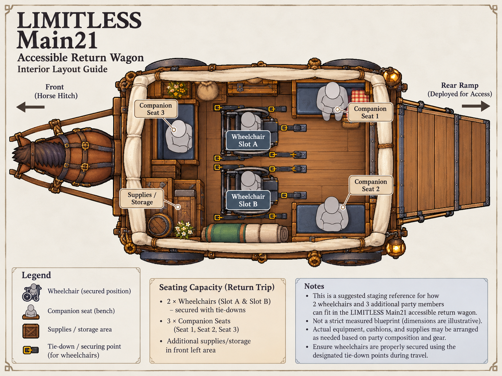
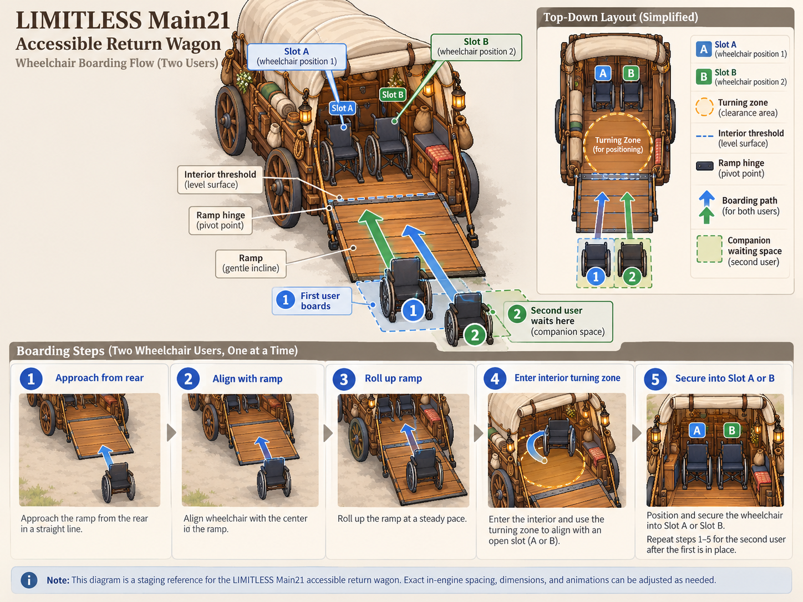
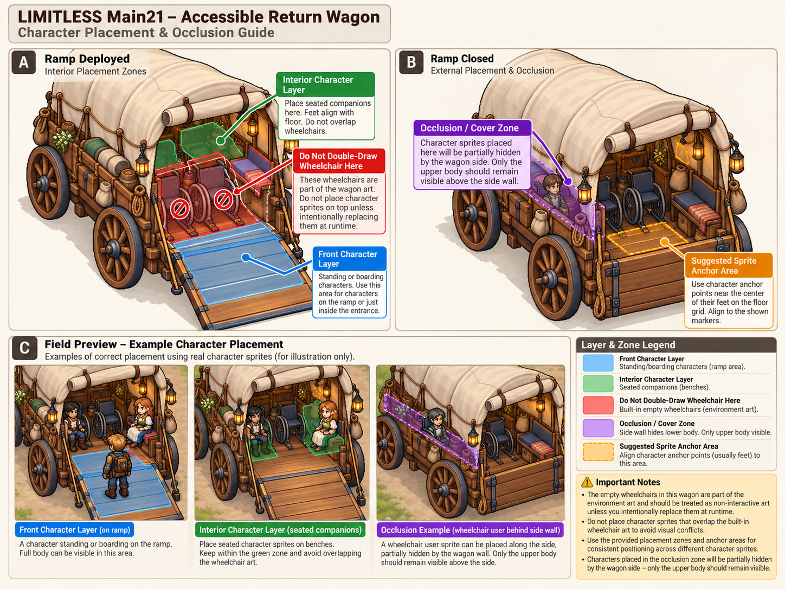
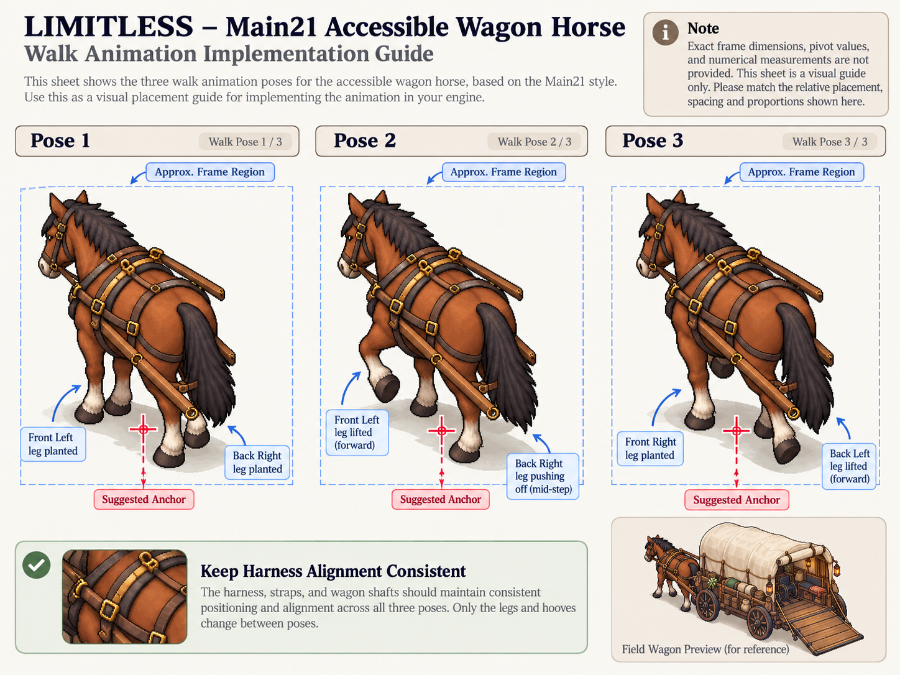

# Main21 접근 가능한 귀환 마차 Supplement v1 검수

2026-10-10 · **REFERENCE_DECODE_PASS / CAPACITY_PARTIAL / RAMP_PARTIAL / ANIMATION_SPEC_PENDING / USER_REVIEW_PENDING**

## 구성 및 원본 대응

ZIP `F:/Downloads/Limitless_Main21_Accessible_Wagon_Supplement_v1.zip`, 8,900,073bytes, SHA256 `a03561aba30ad945efbc11282cb87557433e8496894dd2138d0487ea9bc1cd48`. CRC PASS, Manifest.md와 PNG4종 경로/역할 일치, 전부 RGB1448×1086 정상 디코딩. 알파 없는 배경·주석 포함 **참고 도해**이며 신규 게임 Sprite/분리 레이어/프레임 데이터가 아니다. Unity 신규 Import **0개**. 기존 V1/원본 ZIP/PNG/meta/GUID/캐릭터 Sprite를 덮어쓰지 않았다.

기존 [v1 검수](Main21_Accessible_Wagon_Art_v1_Inspection_20261010.md)의 정지 Sprite2/참고 Texture2 등록은 유지한다. 이번 Supplement가 기존 시트의 정밀 Rect/Pivot을 대신하지 않는다.

## 휠체어2대·승객5명

Interior Guide는 Wheelchair Slot A/B + Companion Seat1/2/3 + 별도 짐 공간을 보여준다. 폴/지체 Player를 A/B에, 미엘·태온·세린을3좌석에 대응하는 **기획 배치 후보**로 사용할 수 있다. 누가 A/B나 어느 좌석에 앉는지는 미확정이다. 플레이어 다른 Path에서도 같은 마차를 유지한다.

그러나 도해는 스스로 'not a strict measured blueprint'라고 설명하며 숫자 치수를 제공하지 않는다. 휠체어 폭/길이·실내 유효 폭/높이·램프 폭/기울기·짐 적재 후 회전 여유를 임의 산정하지 않았다. **설정과 개념 배치는 부합 / 실제 이동·고정 공간의 완전한 검증은 PARTIAL·USER_REVIEW_PENDING**.

기존 RampOpen/RampClosed에서 확실히 보이는 것은 우측 벤치와 앞쪽 짐이다. 상면 도해의 Seat3는 전방 좌측에 새 좌석을 제시하므로, 기존 PNG의 짐/좌석 가림과 대응을 명확히 해야 한다. 참고 도해의3좌석이 곧 기존 본체 Sprite의3인 탑승 레이어라고 가정하지 않는다. 최종 내부 평면/의도된 좌석 가림·짐 배치와5인 합성 확인이 필요하다.

## 램프 동선

후방 접근→램프 정렬→한 명씩 진입→내부 Turning Zone→Slot A/B 고정→다음 사용자가 반복하는 순서를 제시한다. 두 번째 사용자는 램프 밖 대기 구간을 사용한다. 문턱은 level surface, 램프는 gentle incline으로 설명되지만 **수치 검증은 없다**. 먼저 고정한 휠체어가 두 번째 사용자의 회전/보행 승객 동선을 막지 않는지 확인해야 한다. 탑승 완료→램프 접힘·문 닫힘은 기존 Closed 아트를 참조하되 실제 접힘 프레임/힌지좌표는 미제공이다. PARTIAL 판정이며 강제 들기·보행 Sprite 전환을 사용하지 않는다.

## 빈 휠체어 중복과 가림

Placement/Occlusion Guide는 빨간 영역의 내장 빈 휠체어 위에 완전한 캐릭터/휠체어를 중복 합성하지 말라고 안내한다. 전경 탑승 구간·실내 좌석 구간·차체 측면 가림 구간을 구분하고 가림 구간에서는 상체만 보이도록 제안한다.

이는 **방식 참고**이며 실제 투명 전경/후경·Mask PNG는 없다. 기존 Sprite 하나의 SortingOrder만으로 몸체 일부를 벽 뒤에 넣으면서 일부는 앞에 놓을 수 있다고 가정하지 않는다. 원본 Player/Paul을 자르거나 수정하지 않고 별도 가림 레이어/마스크 또는 표시용 합성 구조를 후속 설계한다. 휠체어를 지워 강제로 걷게 하는 연출은 금지한다. 도해 속 예시 캐릭터는 공식 LIMITLESS Player/Paul/동료 Sprite로 등록하지 않는다.

## 말3포즈

Guide는 Pose1→Pose2→Pose3의 표시 순서·발 움직임·Suggested Anchor·Harness Alignment를 제안한다. **Approx. Frame Region**이며 'Exact frame dimensions, pivot values, and numerical measurements are not provided'라고 명시한다. 정확 Rect·공통 Pivot/발 접지점·FPS/루프 순서·원본 시트 좌표 대응이 미제공이다.

기존 v1의418px 균등 분할 경계 문제는 **미해결**이다. 신규 독립 프레임 PNG/정밀 메타데이터가 없어 Slice/Animation Import0. 기존 참고 Texture 유지. 다음 납품: 동일 공통 캔버스·패딩을 가진 독립3프레임 또는 정확 Rect+공통 접지점/Pivot+순서/FPS/반복 정책+말/견인부 Anchor/Scale. 검증 전 도해를 숫자좌표로 추출하거나 임의 Grid Slice하지 않는다.

## 구현 계약과 미결 사항

[구현 준비 정본](../03_스토리/Main21_자동귀환_마차_구현준비_20261010.md)에 최신 참고 계약을 연결했다. 필요한 후보 Anchor: WagonRoot/BoardingEntry/RampHinge/TurningZone/WheelchairSlot_A/B/PassengerSeat1~3/Hitch/HorseRoot. 좌표/Scale/Sorting 수치는 **TBD**. 접지선·상태 전환 정렬·5인 배치·가림 레이어 제작·견인 비례 검토·정밀 말 프레임 자료가 필요하다.

아르벨 Yes/No→10~15초 목표 연출→선택 Skip→안전한 마을 Spawn 방향 유지. 이번 Quest/Objective·Controller·Scene Transition·연출 Scene/Prefab·강제 이동·실제 주행·Save/BGM/TTS 구현0. 전투3인/폴과Player 구분/Slow Burn/세린 역할/하렌 이름 및 마지막 `잘.했.어.` 보호. A의 StarterVillage 통합과 독립된 B 문서 검수 commit으로 관리한다. Push0.

## 원본 도해와 증거

[PNG 무결성](Evidence/Main21WagonSupplement_v1_20261010/audit.json)

