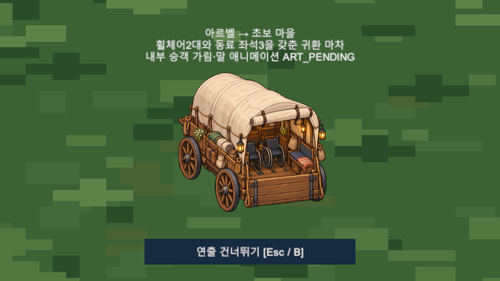
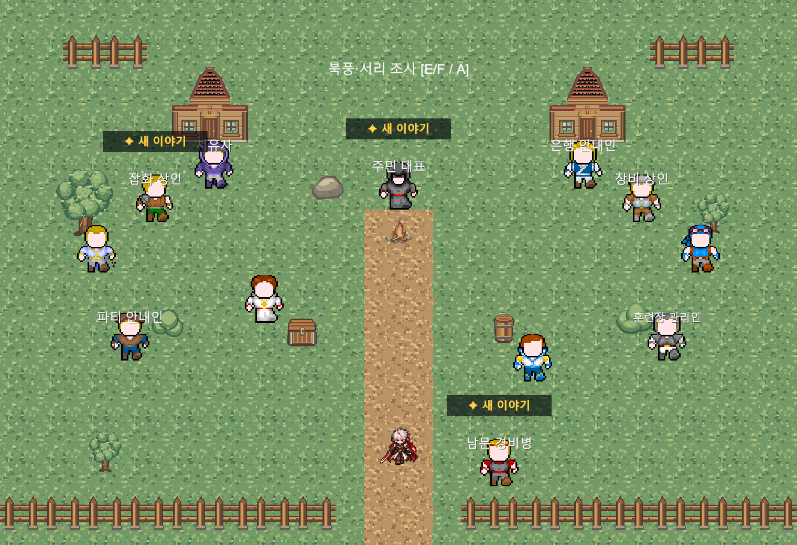

# Main21 구현 및 격리 QA — 2026-10-10

구현 Commit: `546ade248a33f14a4a62bcfcdc3c6b0d1411c715`.

상태: DESIGN_CONFIRMED / IMPLEMENTED / QA_PARTIAL / USER_REVIEW_PENDING. Unity6000.6.5f1. 상세 설계 Commit `6ce4fd3`; StarterVillage 승인 Scene/NPC 기준 `7309f772`. GitHub main 읽기 확인은 기준7309f772와 일치, Push0.

## 구현 범위

[상세 정본](../03_스토리/Chapter2_Main21_돌아온_온기.md)의 정확한13목표·A/B 기존몬스터·3단서 판단 퍼즐·레온 보고·직접 주민지원·접근 가능한 동일마차 Yes/No/12초/Skip·북쪽 조사·하렌 텍스트 첫등장·Chapter2 종료를 구현했다. 기존 Scene/Prefab/아트/음원/SaveVersion/슬롯수 변경0. 공통 코드 변경은 Quest 선택 Save플래그, A/B Encounter 분기, 레온 목표별 연결, 실패를 반환하는 기존 SceneTransition 최소 보완이다.

## 결과

| 항목 | 판정 / 실제 검사 |
|---|---|
| Main21 Runtime | 기능 PASS213건. Main20 미완료 차단/완료 시작,13목표 순차,보상100/60/Item0한번 |
| 전투A/B | PASS: 실제 BattleSceneController 진입/승패도망재도전/기존Monster수치와Formation/3인 자유 편성/승리Continue/중복 진행 차단 |
| 퍼즐/Path | PASS: 실제5Path 정보 접근·Player첫관찰·3단서 자유순서/부분Continue/오답 비용0/정답한번 |
| Field10 지형 | PASS: 기존Bounds/Collider에서7목표+3단서 지점 안전,Scene/Geometry 수정0 |
| 귀환 | PASS: Yes/No/중복수락·Skip/정상12초/수락후Continue/일반마을진입 미완료/Spawn지연/배치전종료 복구/저장실패출발0/로드사전검사 |
| 마을 | PASS335건: 활성환경300/비활성2/15종/PPU128/Scale/NPC12 StableID·이름·QuestMarker·접근공간/남문Collider/Bounds/RenderTexture |
| Save/Continue | PASS: 격리 Save만 사용, Bootstrap 실제Continue Button,다른 슬롯2~5 파일 불변·구버전 선택플래그0 |
| 하렌/Chapter3 | PASS: 텍스트 Story표시만·Roster불변·Chapter2 종료·Main22 자동진입0 |
| 기존서브/메인서비스 | PASS588건: 서브9종 실제NPC/UI/Inventory/Continue 및 Main01~21 서비스; Console Search예외로 Audit전체 FAIL |
| Main18 | 기능 PASS467건: 냉각약 보고/상점/과열AI/실제전투·재도전/완료보상/Continue. 기존의뢰UI·현행출구 검사보정,Console Search별도 |
| Main19 | 기능 PASS169건: 실제A/B 전투·패배/도망재도전·보상·Continue·기존Field09복귀. 아래격리검사계약 보정,Console Search별도 |
| Main20 | 기능 PASS150건: 기존보스Phase/행동/보상/패배/저장/Continue/완료; Console Search예외로 Audit전체 FAIL |
| Console | FAIL: 격리 SearchDatabase/IndexationOnStartup ArgumentOutOfRangeException1건. 기존 미해결 Search예외2건 이슈 유지. 전체QA PARTIAL |
| 의도적 Save I/O 실패 | EXPECTED_ERROR1건: 격리 저장 경로를 파일로 차단한 시험. 일반 오류를 숨기지 않고 별도 표기 |
| 원본 Editor | 읽기 전용 MCP Compile/Console Error0. Bootstrap/Edit 유지,Play/Scene전환/화면조작0 |

전투 결과 분기는 격리 Audit에서 HP/결과 조건을 주입해 실제Controller 공용 처리·보상·복귀를 확인했다. Main21 전체 일반 턴 조작 난이도·전직업 밸런스·전체 도보 이동 경로·30~45분 소요는 NOT_VERIFIED이며 서비스/분기 회귀를 완전한 수동 플레이로 확대하지 않는다.

## 보호와 대기

원본 보호3466파일 중 허용된 공통C#5개만 변경,나머지3461개 SHA256 불변/삭제0. 기존Git335상태항목 유지. 사용자 Save·설정·StarterVillage Scene/NPCPrefab·BGM/TTS·공식Character/ThirdParty/PNG/meta 보호. 신규Asset GUID 누락0. 승인 원문21개 글자 동일,Manifest23개 ID고유/NPC음성17개 TTS_PENDING/Player·지문 VoiceExpected=false,신규WAV0.

ART_PENDING: 하렌공식Sprite/Portrait,말정밀프레임·Pivot·접지/Anchor,내부승객가림,휠체어2+5인 실측 배치 최종 미술. USER_REVIEW_PENDING: 텍스트 표식 배치·조사/지원 플레이 감각·대사·마차연출·BGM전환. 다음: 위 사용자검토와 아트/TTS 후속납품,기존Search 내부예외의 별도복구.

## 증거

[Main21 Runtime](Evidence/Main21_20261010/main21_runtime_results.txt), [Console 원문](Evidence/Main21_20261010/main21_console_errors.txt), [마을335검사](Evidence/Main21_20261010/village_latest_checks.txt), [서브/서비스 회귀](Evidence/Main21_20261010/sidequest_regression_results.txt), [Main20 회귀](Evidence/Main21_20261010/main20_regression_results.txt), [보호해시 요약](Evidence/Main21_20261010/protection_result.json).

### 구형 Main19 검사 계약 보정

Main20 구현이 이미 Field10 서쪽 출구를 열고 선행 Gate를 설치했으므로 과거 Main19 Audit의 서쪽폐쇄/출구1개/완료후막힌길대화 기대값3개가 현행 Runtime과 충돌했다. 원본파일은 그대로 보존하고 격리 검사만 양쪽출구/선행Gate/완료후구형안내숨김을 확인하도록 보정했다. [보정 내역](Evidence/Main21_20261010/main19_audit_contract_adjustments.txt)·[Main19 결과](Evidence/Main21_20261010/main19_regression_results.txt). 기존 기능을 수정해 검사를 통과시키지 않았다. 실행중Search예외는 전체QA PARTIAL에 포함한다.

### Main18 실제 NPC 경로와 입력 경계

구형 Audit은 서브 의뢰 선택창을 처리하지 않았고, 같은 프레임에 업무 버튼을 호출한 보완도 기존 input guard에 의해 차단됐다. HEAD NPC/Main21 미설치 비교로 동일 재현했다. 격리 검사에서 NPC 인접 위치와 다음 프레임 선택을 사용하자 냉각약3개 보고 및 전체회귀가 통과했다. Main19 도입 후 Field09 양쪽출구/서쪽선행Gate 기대값도 현행 계약으로 확인했다. 원본 게임/UI/검사 파일 수정0. [보정 내역](Evidence/Main21_20261010/main18_audit_contract_adjustments.txt)·[실제 결과](Evidence/Main21_20261010/main18_regression_results.txt).
