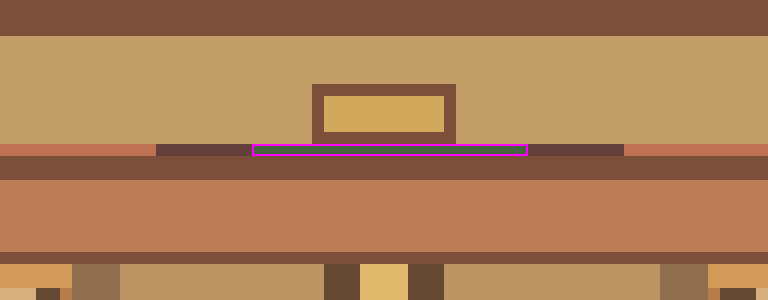
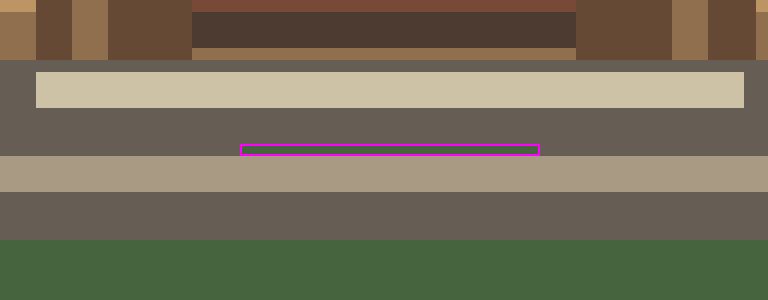
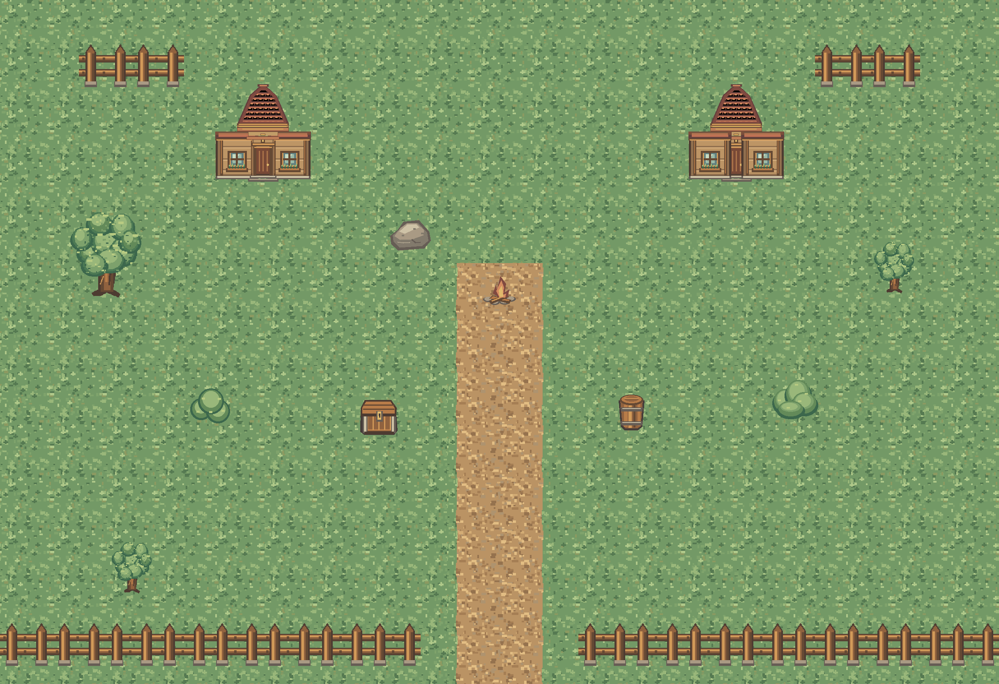

# StarterVillage 리뉴얼 아트 v2 기술 검수

2026-10-10 · Unity `6000.6.5f1` · **NEEDS_ART_CORRECTION / 실제 통합 중단**

v1의 지붕 접합 약14px 공백과 길 좌우 매핑은 해결됐다. 다만 기존 벽·문 64px 겹침 배치에서 문 위·아래에 실제 배경이 비치는 1px 높이의 공백이 남아 있다. 필수 접합 검사 FAIL이므로 사용자 지시에 따라 신규 Unity Import·Sprite 참조 교체·Scene/Prefab/Generator 수정은 하지 않았다. 기술 통과 및 최종 미술 승인도 아직 아니다(`USER_ART_REVIEW_PENDING`).

## 입력과 무결성

- 원본: `F:/Downloads/Limitless_StarterVillage_Renewal_Art_v2.zip` — 읽기 전용 검사, 원본 수정0.
- ZIP SHA256: `a78a612d1e89cb826a245c3e7c6ff80bee3350b327e74e8c00bf889c295421b4`.
- 항목23개 = 게임 PNG15 + Preview PNG5 + Manifest.json/Manifest.md/ChangeNotes.md. CRC 전체 PASS, PNG20개 완전 디코드 PASS, 모든 PNG RGBA.
- 게임15종의 실제 치수·Manifest SHA256·JSON/Markdown 역할 대응 PASS. 건물3종만 v1과 다르고 나머지12종은 v1 ZIP과 byte 동일.
- Manifest의 PPU128·Pivot(0.5,0.5) 계약은 기존 Scene과 호환된다. Unity에 가져오지 않았으므로 실제 신규 TextureImporter의 Point/Mipmap Off/무압축 설정 검증은 **NOT_VERIFIED**다.
- 기준: [LOCAL 배치 정본](StarterVillage_Renewal_Baseline_20261009.md), [v1 검사](StarterVillage_Renewal_Art_v1_Inspection_20261009.md). 이전 분석 JSON의 Scene/남문 Prefab SHA가 현재 파일 SHA와 일치함을 다시 확인했다.

## 필수 FAIL: 문 조립부에 남은 투명 공백

좌표는 **원본 PNG 좌상단(0,0), x 오른쪽 / y 아래**, 0부터 센다. 실제 기존 배치는 지붕/문 x=-4.5 또는+4.5, 벽 x=문 x±0.5, 지붕 y4.5, 벽·문 y3.5다. PPU128, 중앙 Pivot이며 문과 각 벽이 64px씩 겹친다.

| 위치 | `LL_C1_SV_House_Door_128_v2.png` 좌표 | 합성 후 공백 | 겹친 벽의 투명 좌표 |
| --- | --- | --- | --- |
| 문 상단 헤더 아래 | y10, x53..75 | **23×1px** | 왼벽 y10 x117..127 / 오른벽 y10 x0..11 |
| 문 하단 발판 위 | y114, x52..76 | **25×1px** | 왼벽 y114 x116..127 / 오른벽 y114 x0..12 |

문 및 겹치는 벽 픽셀의 alpha가 모두0이다. 지붕은 해당 높이에 없어서 가리지 못한다. 두 건물, 문을 마지막에 그리는 순서와 벽을 마지막에 그리는 순서에서 동일하다. 상단 원본 문 자체의 투명 구간은 x53..76이지만 오른벽이 x76 한 픽셀을 덮으므로 **실제 합성 공백은23px**다. 과장한24px 수치를 사용하지 않는다.

수정 요청 대상은 `Buildings/LL_C1_SV_House_Door_128_v2.png`다. 현재 좌표·PPU·Pivot·64px 겹침을 유지하면서 위 공백이 배경 투과 없이 닫히도록 아트 담당이 수정해야 한다. 벽을 함께 수정하는 대안도 가능하지만 기존 실제 배치 양쪽 그리기 순서로 재검사해야 한다. 자동으로 원본을 덧칠하거나 Collider/Scene 배치를 바꾸어 문제를 숨기지 않았다.

[무배경 조립·원본 알파 독립 검사 JSON](StarterVillage_Renewal_v2_Evidence_20261010/gap_confirmation.json). [두 그리기 순서 비교](StarterVillage_Renewal_v2_Evidence_20261010/building_both_orders.png).

## 해결된 문제와 반복 경계

- 지붕 마지막 행(y127)과 벽/문 첫 행(y0)이 맞닿는다. 기존 약14px 수직 틈은 제거됐다. 지붕 좌우 캔버스 끝(x0/x127)의 불투명 픽셀0, 하단126픽셀 불투명: 이전 우측 가장자리 절단 우려도 해소됐다.
- `tiles_grass_4_4` → **Path_Left / X=-0.5**, `tiles_grass_5_4` → **Path_Right / X=+0.5**. Manifest.json/Manifest.md/실제 PNG의 바깥 잔디·중앙 흙길 방향 모두 일치한다. v1 검사 때 반대로 합성됐던 길 증거는 이번에 올바른 방향으로 다시 만들었다.
- 잔디6×6, 길6행, 울타리6개 반복 합성 확인. 잔디·흙길은 텍스처 무늬가 반복되지만 필수 알파 단절이나 반대 방향 연결 오류는 없다. 길 중앙 RGB 평균 경계 차2.875/255, 울타리 좌우128/128 RGBA 동일. 이런 수치만으로 최종 미술 품질을 승인하지 않는다.
- 잔디 무늬 밀도·반복감, 건물 비례·문 장식의 겹침 표현은 미술 검토 사항이다. **배경 투과 접합 공백은 별도의 기술 FAIL**이다.

[잔디 반복](StarterVillage_Renewal_v2_Evidence_20261010/grass_6x6.png) · [올바른 좌우 길 반복](StarterVillage_Renewal_v2_Evidence_20261010/path_correct_mapping_6x6.png) · [울타리 반복](StarterVillage_Renewal_v2_Evidence_20261010/fence_6x1.png) · [검사 수치](StarterVillage_Renewal_v2_Evidence_20261010/audit.json) · [v1과 동일한12종](StarterVillage_Renewal_v2_Evidence_20261010/unchanged12.json).

## 게임 환경15종 대응

공통 PPU128/Pivot(0.5,0.5). 경로는 ZIP 내부이며 기존 위치·Scale·Sorting Order·Collider는 이번에 변경0.

| 기존 Sprite | 신규 PNG | 실제 크기(px) | Scene Renderer / 남문 |
| --- | --- | --- | --- |
| tiles_grass_4_0 | Ground/LL_C1_SV_Ground_Grass_128_v1.png | 128×128 | 247 |
| tiles_grass_4_4 | Ground/LL_C1_SV_Path_Left_128_v1.png | 128×128 | 8 |
| tiles_grass_5_4 | Ground/LL_C1_SV_Path_Right_128_v1.png | 128×128 | 8 |
| house_tiles_new_4_4 | Buildings/LL_C1_SV_House_Roof_Center_128_v2.png | 128×128 | 2 |
| house_tiles_new_1_3 | Buildings/LL_C1_SV_House_Wall_Window_128_v2.png | 128×128 | 4 |
| house_tiles_new_1_1 | Buildings/LL_C1_SV_House_Door_128_v2.png | 128×128 | 2 |
| fence_tiles_2_2 | Props/LL_C1_SV_Fence_Wood_128_v1.png | 128×128 | 4 / 활성16+비활성2 |
| tree_medium | Props/LL_C1_SV_Tree_Medium_128x156_v1.png | 128×156 | 2 |
| tree_big | Props/LL_C1_SV_Tree_Big_255x256_v1.png | 255×256 | 1 |
| bush_01 | Props/LL_C1_SV_Bush_A_128_v1.png | 128×128 | 1 |
| bush_02 | Props/LL_C1_SV_Bush_B_128_v1.png | 128×128 | 1 |
| rock_01 | Props/LL_C1_SV_Rock_128_v1.png | 128×128 | 1 |
| Wooden_Barrel_Type_A | Props/LL_C1_SV_Barrel_128_v1.png | 128×128 | 1 |
| Wooden_Chest_Type_A | Props/LL_C1_SV_Chest_128_v1.png | 128×128 | 1 |
| Campfire_Type_A | Props/LL_C1_SV_Campfire_128_v1.png | 128×128 | 1 |

Scene284개와 남문 활성16개, 비활성 참조2개 유지. **무료 환경 Sprite 참조 교체0 / 신규 Unity Sprite·GUID0**. 기존 무료 PNG/meta/GUID 및 다른 Scene 참조 보존.

## 실제 배치 검토 이미지

아래는 현재 파일 SHA와 일치하는 LOCAL 배치284개와 남문 활성16개를 이용한 **PNG 합성**이다. 왼집은 문 마지막, 오른집은 벽 마지막 순서로 두 경우를 보여 준다. Unity RenderTexture 캡처나 최종 NPC/이름표/Marker 화면이 아니다.

## Generator 및 기능 보호

`StarterVillageSceneGenerator`의 `CreateGridSprite/CreateBasicSprite/CreateEssentialSprite`는 아직 구형 무료 Sprite를 읽는다. `Field01SceneGenerator.CreateStarterVillageSouthGatePrefab`도 공용 `CreateFence`를 통해 구형 울타리를 읽는다. 이번 FAIL로 두 Generator 수정/실행은 중단했다. 후속 PASS 통합에서는 마을 전용 신규 매핑과 **남문 생성부에 한정한 울타리 연결**을 함께 처리해야 하며 Field_01의 공용 환경 Sprite까지 바꾸면 안 된다.

원본 Scene SHA256 `c86036a1c4dd3472ebf2efc810e9b9886f411e6feee0ff7a3c313910b6540105`, 남문 Prefab `04d5ba49c05b52d757e5620a58aa03857cfb86379e0f1c7cb40ae5523511e8de` 유지. 시작/복귀 Spawn·남문·Bounds/Collider·NPC12/Stable ID·상점/은행/치유/파티·Main01/05/12·Side5·Marker/Navigation·향후 Main21 공간·캐릭터 Sprite/Portrait에 변경0.

## 검증과 남은 작업

| 항목 | 결과 / 한계 |
| --- | --- |
| ZIP·디코드·15역할·치수·Manifest | PASS |
| 기존14px 지붕 접합·길 좌우 오류 | 해결 PASS |
| 실제64px 겹침 문 조립부 | **FAIL: 상단23×1px/하단25×1px 투과** |
| 현재 Unity 상태·Console | MCP 읽기 확인: 6000.6.5f1 / Bootstrap / Edit Mode / 포커스false / Compile·Import idle / 현재 Console Error0 |
| 신규 Import/Missing Sprite/Missing Script/RenderTexture | NOT_VERIFIED — 기술 FAIL로 가져오지 않음 |
| NPC 외형·이름·Quest Marker 가독성 | NOT_VERIFIED — 이미지에 NPC/Marker를 렌더링하지 않음 |
| 남문 왕복·NPC 접근·Save/Continue·Main/Side Runtime 회귀 | NOT_VERIFIED — Play Mode·격리 Editor 실행0 |
| 원본 보호 | Unity/Tools/UserData 보호3537파일 SHA 전후 동일, 삭제0·이동0; 실제 Save/설정 SHA 동일 |
| Git | 기존 사용자 변경 보존. A 문서 commit `0278d4101f080e2482fd48bafc2cfc6d409aec11`과 B 검수 문서 commit 분리. Push0 |

실제 저장 파일 `Unity/Client/UserData/Saves/save_slot_01.json` SHA256 `2e0d30a25428d5794e5e88822306c4ccbd0854b33d12cf3c847f354983eafd46`, `Unity/Client/UserData/Settings/user_settings.json` `a7fb944f7dc4086b8f71dc4e47a8f65e4cd7f38c9ba162cf21166e19936c9e3a` 불변이다. [보호 파일·Save 해시 확인](StarterVillage_Renewal_v2_Evidence_20261010/protection_summary.json). 백업 수정0.

다음은 위 문 PNG 수정본을 같은 실제 배치로 재검수하는 것이다. PASS 후 신규 Art Import·Scene/남문 참조 교체·Generator 대응·비대화형 회귀 검증을 진행한다. **현재 구현 commit은 없으며 B commit은 검수 기록만 포함한다.** 화면 조작/추가 Editor/강제 종료/Scene 전환/Play Mode/원본 ZIP 수정은 모두0이다.
