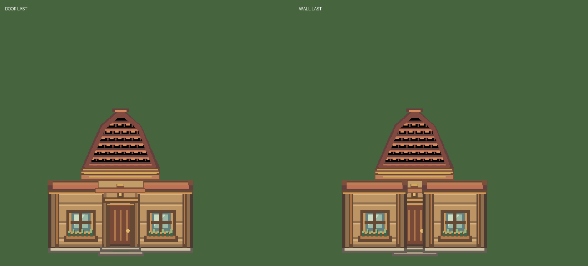
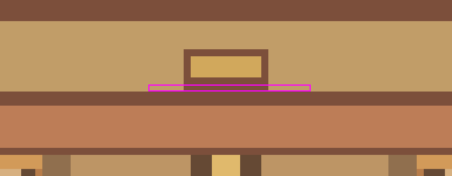

# StarterVillage 리뉴얼 아트 v3 최종 기술 검수 — 2026-10-10

**NEEDS_ART_CORRECTION / UNITY_INTEGRATION_BLOCKED / USER_ART_REVIEW_PENDING**

## 판정

상단 틈은 해결됐지만 하단 틈이 남아 있어 기술 PASS 조건을 충족하지 못했다. 사용자 지시에 따라 Unity 통합을 중단했다. 환경 Sprite 교체 **0/300**, 비활성 참조 교체 **0/2**. 신규 Unity Art/GUID 등록, Scene/Prefab/Generator 변경, Editor 실행·조작·Play 모두 0이다.

기준: [Baseline](StarterVillage_Renewal_Baseline_20261009.md), [v1 검수](StarterVillage_Renewal_Art_v1_Inspection_20261009.md), [v2 검수](StarterVillage_Renewal_Art_v2_Inspection_20261010.md). 시작 HEAD `b37b3214feaa06595c07e6a276c7a8e55fec23a2`. 기존 사용자 변경과 CURRENT_STATUS의 기존 미커밋 내용을 보존했다.

## ZIP·규격 검수

- 원본 `F:/Downloads/Limitless_StarterVillage_Renewal_Art_v3.zip`, 302,969 bytes, SHA256 `ff6b3bf62ff01f012a0b80f2cac179f832951d23567725ab05a874f39801b4ae`.
- ZIP CRC PASS (손상 항목 없음), 전체 PNG 21개 디코딩 PASS. 환경 15종의 Manifest JSON/Markdown 경로·SHA256·해상도·PPU128·중앙 Pivot 선언 모두 PASS. 실제 Unity Import 설정은 미검증.
- v2와 비교하여 환경 문 PNG 1개만 변경, 나머지 환경 14개는 바이트 동일. ZIP의 v2 문 zoom PNG 및 Preview는 참고 이미지이며 환경 매핑 대상이 아니다.
- 좌측 `tiles_grass_4_4`→Path_Left(X=-0.5), 우측 `tiles_grass_5_4`→Path_Right(X=+0.5) 매핑 PASS. 잔디 6×6·길 6×6·울타리 6×1 반복 합성 수행. 변경 없는 14종의 기존 v2 구조/반복 상태 유지.
- 기존 지붕 하단 14px 간격 재발 없음. 중앙 지붕 상부 장식의 투명 외곽은 v2와 동일하며 신규 결함으로 확정하지 않았다.

## 접합 재현 — 정확한 좌표

좌표 원점은 PNG 좌상단, x 오른쪽/y 아래. PPU128, Scale1, 기존 좌우 벽 ±0.5 world unit(64px) 중첩을 그대로 사용했다. 문 우선/벽 우선 두 순서 모두 합성했다.

|검사|문 PNG 좌표|v3 실제 합성|결과|
|---|---|---|---|
|상단|y10, x53~75|23픽셀 모두 비투명; 이전 23×1px 공백 제거|PASS|
|하단|y114, x52~76|25픽셀 모두 alpha=0; 25×1px 배경 투과 유지|FAIL|

문 파일: `Buildings/LL_C1_SV_House_Door_128_v3.png`. 하단에서 왼쪽 벽 `Buildings/LL_C1_SV_House_Wall_Window_128_v2.png`의 y114/x116~127 및 오른쪽 벽 y114/x0~12도 투명하다. 따라서 가림 순서를 바꿔도 공백은 해소되지 않는다. 384×384 합성 캔버스에서는 y370/x180~204다. 문 하단 접합을 수정한 다음 같은 좌표와 두 순서로 재검수해야 한다. 원본 PNG를 Codex가 수정하지 않았다.

## QA 및 보호

무결성·매핑·선언 규격 PASS / 건물 접합 FAIL. 실제 Unity Sprite 참조·RenderTexture·NPC/이름표/Marker·남문 왕복/Collider·Save/Continue·Quest 회귀는 **NOT_VERIFIED**: 기술 검수 실패로 통합 및 런타임 QA를 실행하지 않았다. 합성 이미지는 Unity RenderTexture가 아니다.

이번 작업은 문서와 검수 증거만 작성했다. 기존 Scene/Collider/Spawn/NPC Stable ID/상점·은행·치유·파티/Quest/Save/캐릭터/ThirdParty/meta/GUID/Field_01/마차 공간을 수정하지 않았다. 사용자 화면 조작·포커스 전환·프로세스 종료·Push 없음.

## 검토 이미지 및 증거

[전체 기계 검수](Evidence/StarterVillage_v3_20261010/audit.json) · [좌표별 투과 검사](Evidence/StarterVillage_v3_20261010/gap_confirmation.json). 반복 합성 원본은 `Temp/SVRenewalV3QA/Art/`에 보존했다.
