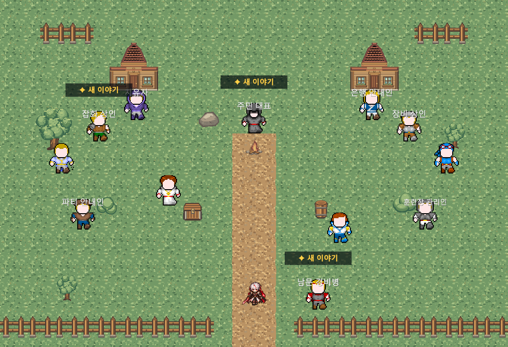
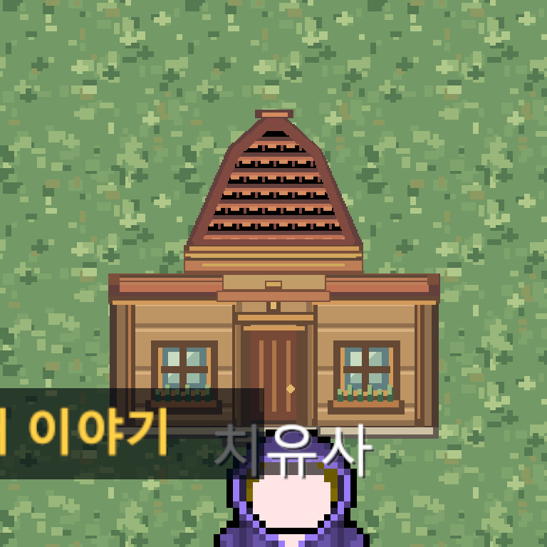
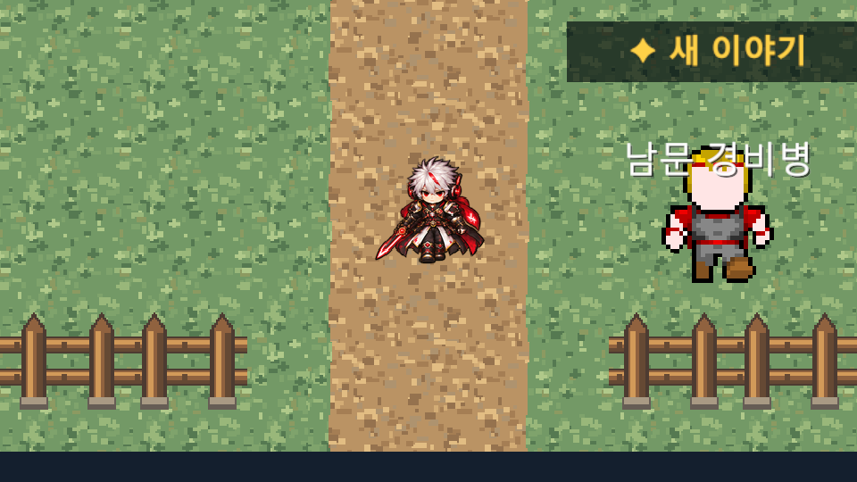

# StarterVillage Renewal Art v4 최종 검수 및 통합 — 2026-10-10

상태: TECHNICAL_PASS / LOCAL_INTEGRATION_APPLIED / USER_ART_APPROVED
Unity: 6000.6.5f1. 원본 ZIP: `F:/Downloads/Limitless_StarterVillage_Renewal_Art_v4.zip`.

## 원본 기술 검사

ZIP CRC 및 전체 PNG 디코딩 PASS. Manifest 환경 15종과 납품 PNG 매핑 PASS. v3 대비 환경 PNG는 문만 변경됐고 나머지 14종은 동일하다. 비교용 확대 이미지와 설명 자료는 환경 Sprite로 등록하지 않았다.

벽·문 64px 중첩을 유지한 문 우선/벽 우선 합성 모두 PASS. 기존 상단 문 좌표 y10/x53~75의 23×1px, 하단 y114/x52~76의 25×1px 투과 공백은 모두 불투명해졌다. 기존 14px 지붕 틈 재발 없음. 좌우 길 매핑과 반복 타일/울타리 연결 검사 PASS. 상세 수치와 합성 이미지는 [증거 폴더](Evidence/StarterVillageV4_20261010/)의 audit.json 및 building_both_orders.png 참조.

## 실제 Unity 통합

전용 경로 `Assets/_Project/Art/Environment/StarterVillage/V4/`에 환경 15종과 신규 GUID를 등록했다. 원본 ZIP PNG와 등록 PNG 해시 일치. 실제 Editor Importer 15종에서 Single Sprite, PPU128, 중앙 Pivot, FullRect, Point, Clamp, Mipmap 비활성, Uncompressed를 확인했다.

| 적용 대상 | 교체 수 |
|---|---:|
| World_StarterVillage 환경 Renderer | 284 |
| SouthGate 활성 울타리 | 16 |
| SouthGate 비활성 참조 | 2 |
| 합계 | 활성300 / 비활성2 |

Scene와 SouthGate는 m_Sprite 참조만 변경했다. 원래 좌표·Scale·Sorting·Collider·Spawn·NPC·Stable ID·서비스·Bounds를 그대로 유지했다. Main21용 공간을 추가하거나 변경하지 않았다.

StarterVillageRenewalArt 전용 로더/Importer를 추가하고 StarterVillageSceneGenerator의 환경 로드와 남문 생성 코드만 연결했다. 누락 시 명시적 오류로 중단하며 구형 ThirdParty 아트로 돌아가지 않는다. 기존 ThirdParty Importer를 건드리는 생성기 코드를 제거했다. Field_01 공용 CreateFence와 다른 지역 Sprite는 그대로다. 생성기를 실제 재실행하거나 Scene를 재생성하지 않았다.

## Git 범위와 기존 Scene 변경 보호

작업 시작 LOCAL Scene는 기존 사용자 변경으로 HEAD와 Renderer ID 전체가 달랐다. HEAD에 LOCAL Sprite 참조 교체만 적용할 수 없어 World_StarterVillage.unity는 실제 LOCAL 적용 후 **미스테이징 상태로 보존**한다. 이 Commit에 사용자 전체 Scene 변경을 섞지 않았다. 대신 LOCAL 기준 Sprite-only 패치, 기준 SHA256 및 참조 매핑을 증거에 기록한다. 기준 Scene SHA256: `c86036a1c4dd3472ebf2efc810e9b9886f411e6feee0ff7a3c313910b6540105`.

Commit에는 신규 아트/Importer 도구, 생성기 두 파일의 관련 변경, SouthGate Prefab의 Sprite 교체, 검수 문서·증거·CURRENT_STATUS의 이번 항목만 포함한다. 기존 MCP 상태 변경과 사용자 변경은 남긴다.

## 백그라운드 QA

원본 Editor는 Bootstrap/Edit Mode를 유지했으며 Console Error0을 확인했다. 포커스 전환 API·화면 조작·원본 Play/Scene 변경·강제 종료를 사용하지 않았다.

Assets/Packages/ProjectSettings만 복사한 별도 `Temp/SVRenewalV4QA/Client`에서 숨김 Batch QA를 실행했다. UserData는 복사하지 않았고 QA 자체 저장 데이터만 사용했다. QA 복사본의 MCP 패키지만 제외하여 원본 MCP 인스턴스에 영향을 주지 않았다.

실제 RenderTexture 전체·집·남문 이미지 생성 PASS. 환경 참조302/활성300/종류15, Missing Sprite/Script0, NPC12/Stable ID/이름표/Quest Marker/서비스 접근점, Bounds·남문 Collider, 최초 Spawn 및 남문 Field_01 왕복·귀환 Spawn·위치 저장 PASS. 연속 키보드 이동 전체 경로는 별도 미검증이다.

QA 최종 집계는 아래 완료 결과에 기록한다. 공용 서비스 검사와 Runtime NPC/Save/Continue 검사는 실제 실행 범위를 구분하며, 모든 Main Quest의 전투 포함 종단 회귀를 완료했다고 해석하지 않는다.

첫 시도는 QA가 최초 Spawn을 귀환 Spawn으로 기대한 검사 오류로 중단됐다. QA 코드만 수정했다. 초기 Library 생성 중 Unity Search 내부 예외도 기록되어 첫 로그를 보존했고, 준비된 Library에서 재실행했다. 생산 게임 코드는 이 오류 때문에 변경하지 않았다.

## 보호 확인 및 후속

작업 시작 보호 해시1257개 중 허용한 Scene·생성기2개 외1254개 불변. Scene/SouthGate의 Sprite 외 직렬화 불변. ThirdParty·기존 캐릭터·Quest·Save·Packages·ProjectSettings·기존 실행 스크립트 보호. 원본 음성 및 기존 마차 v1 콘텐츠293개도 불변 확인. 원본 ZIP 수정0. 신규 아트15개 원본 해시 일치.

사용자가 2026-10-10 최종 미술을 승인했다: USER_ART_APPROVED. 기존 이름표/Quest Marker의 크기·위치는 이번에 변경하지 않았다. 남은 검증: Main01/05/12 전체 이야기·전투 흐름과 실제 연속 이동 수동 검토. GitHub Push0.

## QA 완료 판정

전체: PARTIAL / 격리 Console 무오류 항목 FAIL. 마을 전용 검사 전부 PASS, 공용 서비스 검사 전부 PASS, 서브9종 Runtime 완료 PASS. Main01/05/12를 포함한 Main01~20 공용 서비스 목표 진행 검사 PASS이며 실제 전투 종단 검사와 구분한다. Runtime 무오류 최종 검사만 UnityEditor.Search.SearchDatabase.EnumerateAll → GetDefaultSearchDatabase → IndexationOnStartup의 ArgumentOutOfRangeException으로 FAIL. 동일 예외가 재실행에서도 발생했다. 예외를 무시하거나 무오류 판정을 조작하지 않았다. 신규 환경 기술 검수와 참조·화면·남문·저장 검사는 PASS이므로 LOCAL 통합을 유지한다. 원본 Editor Console Error0. 추가 조치: Unity Search 격리 시작 예외의 별도 진단과 Main 전투 종단 회귀.

집계: {"village": {"PASS": 341, "FAIL": 0}, "service": {"PASS": 366, "FAIL": 0}, "runtime": {"PASS": 573, "FAIL": 2}}

## 최종 미술 승인 및 Commit 분리 재검증 — 2026-10-10

사용자 최종 미술 승인으로 USER_ART_APPROVED로 갱신했다. Unity 화면·Play Mode·Scene 재생성·강제 종료·Push 없이 파일/Git 비교만 수행했다.

통합 전 LOCAL 사본과 현재 LOCAL Scene를 비교한 결과, Sprite 참조284개만 변경됐고 그 외 바이트는 동일하다. 현재 Scene SHA256은 `80c83344d1765aa912d8d54bf89fcc247f1eef8fb4043a90040bcd081fa1cf6e`. HEAD에는 SpriteRenderer500개, LOCAL에는284개이며 공통 Renderer ID는0개다. 기존 사용자 구조 변경을 포함하지 않고 HEAD에 승인된 아트 참조만 적용할 대상이 없어 Scene를 별도 Commit으로 안전하게 분리할 수 없다. LOCAL Scene와 기존 사용자 변경을 미커밋 상태 그대로 보존하고, 이미 Commit된 Sprite-only 패치와 신규 아트/Generator/SouthGate를 유지한다. 이번 Commit은 승인 문서와 CURRENT_STATUS의 관련 부분만 포함한다.

미술 승인은 QA 전체 PASS를 의미하지 않는다. Unity Search 내부 예외2건(격리 QA 첫 실행 및 재실행)은 미해결로 유지한다. 전체 QA PARTIAL, Console 검사 FAIL 및 메인 전투 종단 미검증 판정은 변경하지 않는다. 기존 통합 Commit: `9af4e6886a855a03c0bbfb4f1c56dbf44a80676d`.
