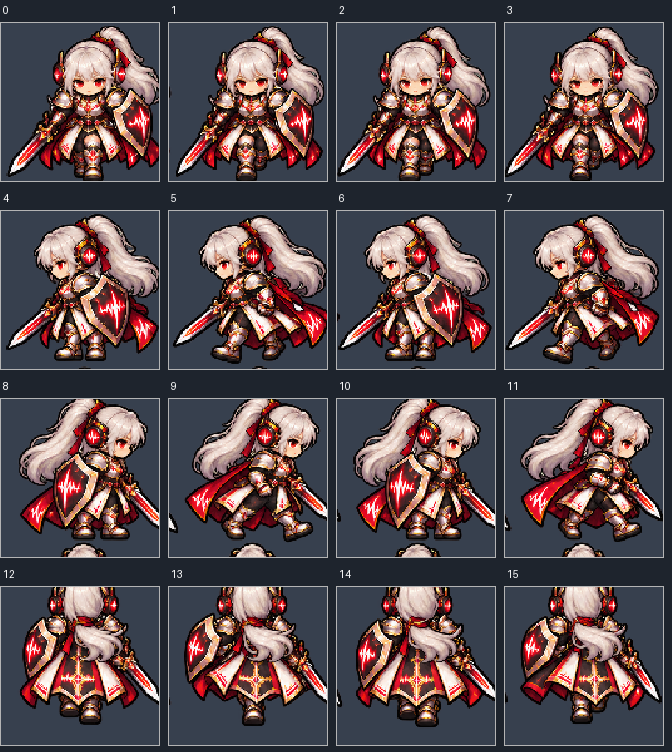

# Hearing 수정판 변환·교체 QA

2026-10-03, 문서 선행 commit `f412331`. 사용자가 원본 보존·별도512×512 변환을 승인했다. 원본 ZIP SHA256은 계약의 값과 동일하며 ZIP 자체는 Git에 추가하지 않았다.

## 입력·교체

PNG10종, Male5/Female5, Fighter/Guardian/Healer/Mage/Marksman 각각2종. Duplicate0/Missing0. 입력1254×1254 RGBA를 전체 시트 최근접 보간으로512×512 RGBA 변환했다. 프레임 재배치·Crop 복원·Alpha 보정·새 디자인 생성은 하지 않았다. 원본은ZIP에 그대로 남고 변환본만 기존 Hearing 경로에 교체했다. 원본/변환본 SHA와 ID 대응은 [Manifest](Hearing_Player_Sprite_Fixed_QA.json)에 있다.

기존 `appearance.external.v1.hearing.{fighter|guardian|healer|mage|marksman}.{male|female}` 10개 ID와 Gender/Path/Job 매핑을 유지했다. Marksman의 정식 Job ID는 `sharpshooter`다. 새 ID와 Save Migration은 만들지 않았다. 기존160 Sprite GUID/local file ID,128×128 Rect·PPU128·하단 중앙 Pivot(64,0)·Point·Uncompressed는 모두 유지됐다. PNG10개 내용만 교체했고 Sprite meta는 동일하다.

## 미술 재판정

10종 모두 `BLOCKED_ART`, Hearing Ready0/Blocked10. 각 시트16개 프레임은 비어 있지 않고 픽셀 해시가 모두 달라 완전 동일 프레임 반복은 없다. 방향 행은 관찰상 Down/Left/Right/Up이며 귀 주변 보조 장치가 유지된다. 다른 캐릭터 교체는 관찰되지 않았지만 경계 절단과 인접 조각 문제가 있으므로 PASS하지 않았다. 실제 걷기 품질·발 미끄러짐·Scale 자연스러움은 미검증이다.

| Job | Gender | 0-based 문제 프레임 | 실제 사유 |
|---|---|---|---|
| Fighter | Female | 5–15 | Right 발 아래 Up 머리 조각, Up 머리 상단 잘림, Left 일부 머리카락 절단 |
| Fighter | Male | 5–15 | Left 망토 절단·인접 조각, Right 발 아래 머리 조각, Up 상단 잘림 |
| Guardian | Female | 8–15 | Right 발 아래 Up 머리 조각, Up 상단 잘림, 일부 무기·머리카락 절단 |
| Guardian | Male | 8–15 | Right 발 아래 Up 머리 조각, Up 상단 잘림 |
| Healer | Female | 1,3,5–15 | 인접 머리카락 조각, Right 발 아래 잔상·지팡이 절단, Up 상단 잘림 |
| Healer | Male | 1–15 | 지팡이·망토 분리 조각, Right 발 아래 머리 조각, Up 상단 잘림 |
| Mage | Female | 1,5–15 | 빨간 지팡이 장식·인접 조각, Right 발 아래 잔상, Up 상단 잘림 |
| Mage | Male | 8–15 | Right 인접 지팡이 장식·머리 조각, Up 상단 잘림 |
| Sharpshooter | Female | 1–15 | 머리카락·무기 조각, Right 발 아래 Up 머리 조각, Up 상단 잘림 |
| Sharpshooter | Male | 5–15 | Left 망토 절단·인접 조각, Right 발 아래 머리 조각, Up 상단 잘림 |

이 판정은 백그라운드로 추출한160프레임 실제 이미지 관찰이다. 경계 접촉 수치만으로 결정한 것이 아니다. 원본이 비정수 Cell 피치에 놓여 있어 전체 축소만으로 셀 내부 독립 배치를 보장할 수 없었다. 후속 수정은 각 캐릭터·무기·장치를 온전히128px Cell 안에 배치하는 원본 미술 작업이다. 자동 삭제·재배치로 문제를 숨기지 않았다.

## Runtime·보존

Hearing 전용 PlayUnfocused 격리 감사 **96 PASS/0 FAIL**. [로그](Hearing_Player_Sprite_Fixed_Runtime_Results.txt). Male/Female ×5Job 실제 UI 자동 Mapping·Preview·Blocked 안내·Hearing Story Path 판정, 대표 Male/Fighter·Female/Sharpshooter의 생성→World→Save→실제 Bootstrap Continue→Battle Left Idle/실제 Battle Scene 전달을 확인했다.

Blocked이므로 Preview/World/Battle의 정상 결과는 기본 성별 **임시 fallback**이다. 수정판을 Runtime에서 Ready로 재생했다고 주장하지 않는다. 수정 PNG는 해당 정의의 sheet/16frames에 연결되어 있지만 기존 정책대로 Runtime 재생하지 않는다. 수정 전 ID가 들어간 개발 Save도 같은 조합/ID를 복원한다. 실제 사용자 Save는 건드리지 않고 격리 경로를 사용했다.

다른40종 PNG/meta의 SHA와 Catalog Entry/Sprite/Clip의 Stable 참조·QA 상태가 시작값과 동일하다. 시작 해시 목록에서 의도된 변경은 Hearing PNG10·공유 Catalog의 Hearing 사유·Inventory의 Hearing 입력/분석 정보뿐이다. 다른 Path 재판정·전체 Import/Build는 하지 않았다. 전체 Ready21/Blocked29 유지. 전체 Matrix JSON과 기존 QA의 Hearing 행만 사유/프레임을 갱신했다.

Foreground/GameView 활성화·OS 포커스 전환은 실행하지 않았다. Compile/Console 확인 및 최종 복원 상태는 CURRENT_STATUS에 기록한다. GitHub Push 없음.
